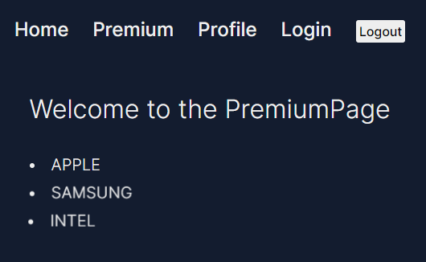
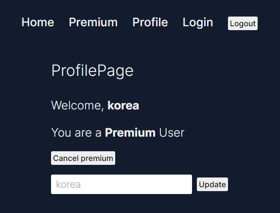
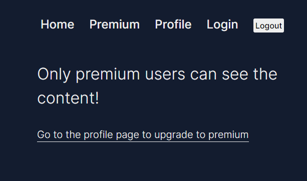
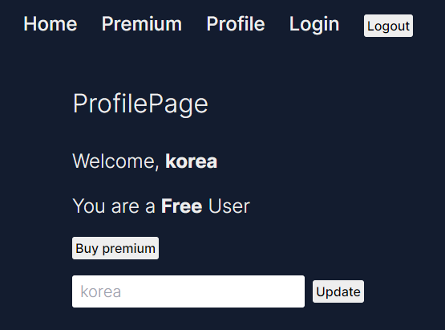

# Nextjs 14에서 login & logout에 대한 권한 여부 개발

## Nextjs 14

- Next.js 애플리케이션에서 사용자 인증 및 세션 관리를 구현한 서버 사이드 코드
- Next.js 애플리케이션에서 사용자 인증 및 세션 관리를 구현하는 예시

### 주요 기능

1. 세션 관리

- getIronSession을 사용하여 안전한 세션 관리
- 사용자의 로그인 상태, 프리미엄 상태, 차단 상태 등을 세션에 저장

2. 사용자 인증

- login 함수를 통한 사용자 로그인 처리
- 사용자명과 비밀번호 검증 (실제 DB 연동은 주석 처리됨)

3. 로그아웃

- logout 함수를 통한 세션 파괴 및 로그아웃 처리

4. 사용자 정보 업데이트

- changePremium 함수로 사용자의 프리미엄 상태 변경
- changeUsername 함수로 사용자명 변경

5. 안전한 쿠키 기반 세션 관리를 위해 iron-session 라이브러리 사용
6. revalidatePath를 사용하여 특정 경로의 캐시 무효화

### Premium & Free user registration

### TEST Login information

- ID : korea
- PW : 1234

### Premium user

### Free user

